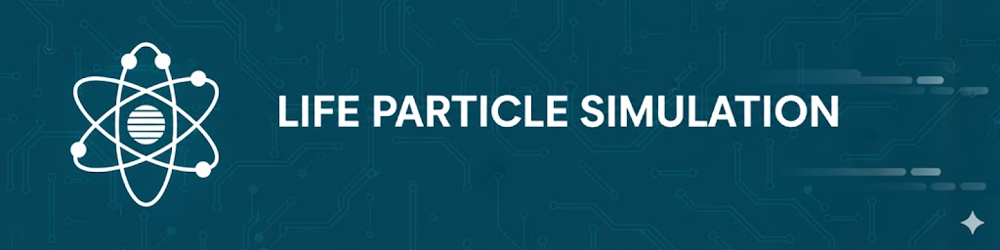

<h1 align="center">
    
</h1>

# LPS - Life Particle Simulator

LPS is a particle simulator that allows users to simulate particles behavior with simple rules in a 2D environment. This project is inspired by Brainxyz's video, which you can find [here](https://www.youtube.com/watch?v=0Kx4Y9TVMGg&t=127s). 

Key features include:
- Fast simulation computation using GPU acceleration.
- Real-time visualization of particle interactions.
- Easy-to-use interface for setting up simulations and viewing results.
- Written in C++, Cuda and GDScript.

To learn more, read the user guide in the [docs](./docs/USER_GUIDE.md) folder.

## Hardware Requirements
- A computer with a CUDA-capable GPU (NVIDIA).
- With the actual build settings, a computer with a Linux OS is required. (Windows and MacOS might work with some adjustments in the SConstruct file).

## Simulator access
You can access the simulator by cloning this repository and building the project using SCons or an executable file is provided in the releases section.

### Building from Source
Requirements:
* Standard Linux OS :
    * CPU architecture x86_64
    * GCC/G++-11
    * NVCC 12.x
    * CUDA-compatible NVIDIA driver (tested with version: 535.261.03)
    * SCons build system
    * Godot Engine V4.5 (for the GUI)
* Windows OS (not tested) :
    * MSVC
    * NVCC
    * SCons build system
    * Godot Engine V4.5 (for the GUI)

Note : If you want to use another version of NVCC, it could work but you might need to adjust the SConstruct file accordingly to use the compatible version of g++.


1. Clone the repository :
   ```bash
   git clone https://github.com/l-christen/life-particle-simulator.git
   cd life-particle-simulator
    ```
2. Retrieve Godot-cpp submodule :
    ```bash
    git submodule init
    git submodule update
    ```
3. Build Godot-cpp dynamic libraries :
    ```bash
    cd native/godot-cpp
    scons platform="linux/windows" target="template_debug/template_release"
    cd ..
    ```
4. Build the GDExtension dynamic library :
    ```bash
    scons platform="linux/windows" target="template_debug/template_release"
    ```
5. Open Godot Engine and load the project located in `./godot`.
6. Run the project or export it as an executable.

### Using Pre-built Executable (Linux only)
1. Go to the [releases](https://github.com/l-christen/life-particle-simulator/releases/)
2. Download the latest release for Linux.
3. Extract the downloaded file. The executable needs to be in the same folder as the .pck file.
4. Run the executable.
Note : Check that your system has the required CUDA drivers installed and the CPU architecture is compatible.

## License
This project is licensed under the MIT License, see the [LICENSE](./LICENSE) file for details.

## Credits
The project banner was generated using Gemini.

