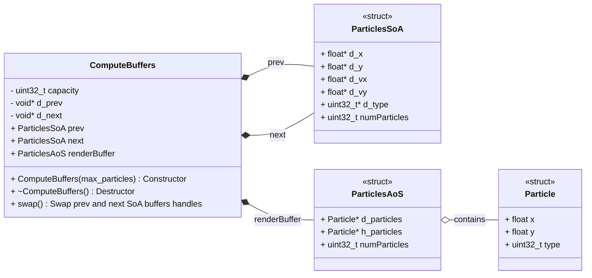
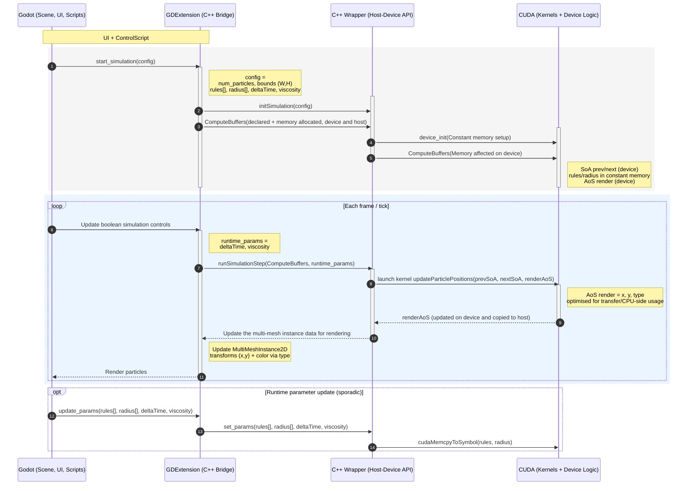

# Developer Guide: GPU Particle Simulation with CUDA and GDExtension

This developer guide provides an in-depth overview of the architecture and implementation details of the GPU-based particle simulation using CUDA, integrated into Godot via GDExtension. It is intended for developers looking to understand the code base.

---

## Architecture first attempt
At first, the aimed achtitecture was the one explicited in the ./01-architecture-choice.md. To summarize, the idea was to keep the simulation data on the GPU all along the simulation. Godot uses Vulkan as rendering backend, and Vulkan can interoperate with CUDA. The idea was to create a Vulkan buffer in Godot, get its handle in the GDExtension, and use it as a CUDA buffer in the simulation. Unfortunately, this approach was not successful due to time constraints and lack of experience with Vulkan, CUDA interop and Godot engine's implementation. The reason of the failure is explicited in ./02-godot-NativeVulkan.md. Thus, the current architecture uses data transfer between GPU and CPU each frame, which is suboptimal but works correctly.

---

## Architecture Overview

The implementation is organized into four distinct layers:

1. **CUDA (Simulation and Device Logic)**
2. **C++ Wrapper (Host - Device Interface)**
3. **GDExtension (Godot - C++ Bridge)**
4. **Godot (Scene, UI, Scripts)**

This separation ensures clarity, maintainability, and a clean boundary between simulation, native code, and engine-level integration.

---

## 1. CUDA Layer

This layer contains all GPU-side logic and memory management related to the particle simulation.

* **`native/src/simulation.cu`**

  * Core simulation logic
  * CUDA kernel implementation
  * Simulation initialization
  * Simulation step execution

* **`native/src/compute_buffers.cpp`**

  * CUDA memory allocation
  * Declaration of device buffers used for computation and rendering

* **`native/include/`**

  * CUDA data structures defining:

    * **SoA (Structure of Arrays)** for efficient GPU computation
    * **AoS (Array of Structures)** for efficient data transfer and rendering

---

## 2. C++ Wrapper Layer

This layer exposes a C++ API to interact with the CUDA simulation from the GDExtension.

* **`native/src/simulation.cuh`**

  * Declarations of `extern "C"` wrapper functions
  * Public interface used by the GDExtension to control the simulation

* **`native/src/simulation.cu`**

  * Implementation of the wrapper functions
  * Kernel launches, synchronization, and data transfers

* **`native/src/compute_buffers.cpp` / `native/include/compute_buffers.h`**

  * C++ classes encapsulating CUDA buffers
  * Abstraction layer between CUDA memory and C++ code

---

## 3. GDExtension Layer (C++)

This layer bridges the native C++ / CUDA code with Godot.

* **`native/src/cuda_particles_renderer.cpp`**
* **`native/include/cuda_particles_renderer.h`**

Responsibilities:
* Exposure of simulation controls to Godot
* Display particles by instantiating a MultiMeshInstance2D node
* High-level API used by GDScript to:

  * Initialize the simulation
  * Run simulation steps
  * Update simulation parameters during runtime

---

## 4. Godot Layer

This layer contains all engine-side logic.

* **`godot/`**

  * Godot scenes and nodes for visualization and interaction

* **`godot/scripts/`**

  * Camera control
  * `ControlScript.gd` acts as the main entry point for:

    * Calling GDExtension methods
    * Setting up the UI
    * Driving the simulation from the UI

* **`godot/extensions/`**

  * GDExtension configuration file
  * References the compiled native module (`.dll` / `.so`)

---
## Data structures and transfer
Computation data are stored in a C++ class called `ComputeBuffers`, which manages CUDA device memory for simulation and host memory for data transfer.

Data structures used:
* **SoA (Structure of Arrays)**: Optimized for GPU computation, used within CUDA kernels. For example, when we compute distances between particles, we only need positions, so having them in separate arrays allows coalesced memory access and not reading unnecessary data like type.
* **AoS (Array of Structures)**: Optimized for data acces CPU-side since the rendering needs the whole particle structure at once.

ComputeBuffers contains two SoA buffers, one for the previous frame and one for the current frame, avoiding read-write conflicts during simulation steps. It also contains one AoS buffer which contains the data to be sent to Godot for rendering.

A particle ready to be rendered is defined by an x and y position (float) and a type (uint32_t). The type defines the color of the particle.

A particle used for simulation contains velocity (float) and the type is used to define interaction rules between particles.

---
## Sequence Diagram
This sequence diagram illustrates the full execution flow of the CUDA-based particle simulation, from initialization to per-frame updates and rendering, as integrated into Godot via a GDExtension.

At startup, the Godot layer (scene, UI, and scripts) triggers the simulation by calling start_simulation. The GDExtension acts as a C++ bridge, receiving the configuration parameters (particle count, simulation bounds, interaction rules, radius, and physical parameters) and forwarding them to the C++ wrapper. During this initialization phase, GPU and host memory are allocated through ComputeBuffers, and constant memory on the device is initialized for interaction rules and radius. At this point, the CUDA layer holds two SoA buffers (prev and next) for simulation steps and an AoS buffer dedicated to rendering data.

During each frame, Godot updates runtime control parameters. According to the state of the simulation (idle, running, paused), the GDExtension requests to the C++ wrapper to runSimulationStep if the simulation is running, which launches the CUDA kernel responsible for updating particle positions and velocities. The kernel reads from the previous SoA buffer, writes results to the next SoA buffer, and simultaneously updates the AoS render buffer. This AoS representation is optimized for efficient transfer back to the CPU.

Once the kernel execution completes, the updated render buffer is copied to host memory and returned through the wrapper to the GDExtension. The GDExtension then updates the MultiMeshInstance2D data (positions and colors derived from particle types), allowing Godot to render the particles efficiently.

Finally, the diagram also shows an optional path for updating simulation parameters at runtime if simulation is paused. When interaction rules or radius change, they are copied to CUDA constant memory using cudaMemcpyToSymbol, ensuring fast read access during subsequent kernel executions.

---
## Build System and Dependencies

* **`native/SConstruct`**

  * Build configuration for the GDExtension (Linux and Windows)
  * Handles compilation and linking of CUDA and C++ code

Note: At the moment, the Linux build is the only fully validated configuration. It is tested using NVCC 12.x with g++-11 explicitly set as the host compiler. If you have another version of NVCC for linux, you might need to adjust the configuration. The Godot engine version used is 4.5. Windows build needs some adjustments.

* **`godot-cpp V4.5` submodule**

  * Added as a dependency
  * Allows building the GDExtension without compiling the entire Godot engine

---
## Future Improvements
* Performance optimizations :
    * Full GPU to avoid data transfer each frame
    * Desynchronize simulation and rendering rates
    * Spatial partitioning
* Performance optimizations without full GPU : 
    * Use mapped memory to transfer data during computation, not after
    * Push positions and colors particles to Godot's MultiMesh in one call
* Simulation improvements :
    * Allow user to add more particles types
    * Add more interaction rules between particles
    * Allow user to record and playback simulations
    * Allow user to define particles behavior at boundaries
    * Allow user to save simulation parameters presets
    * Add 3D simulation mode