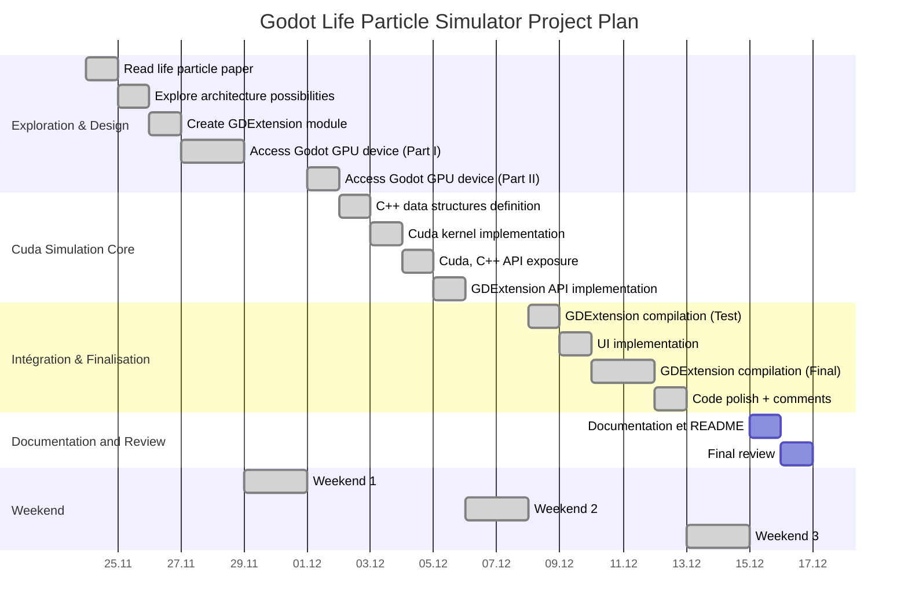

```mermaid
gantt
    dateFormat  YYYY-MM-DD
    axisFormat %d.%m
    title Godot Life Particle Simulator Project Plan
    
    %% --- Tâches Terminées (Done) ---
    section Exploration & Design
    Read life particle paper     :done, a1, 2025-11-24, 1d
    Explore architecture possibilities :done, a2, after a1, 1d
    Create GDExtension module    :done, b1, 2025-11-26, 1d
    Access Godot GPU device (Part I):done, b2, after b1, 2d
    Access Godot GPU device (Part II):done, b3, 2025-12-01, 1d
    
    section Cuda Simulation Core
    C++ data structures definition :done, c1, after b3, 1d
    Cuda kernel implementation     :done, c2, after c1, 1d
    Cuda, C++ API exposure         :done, c3, after c2, 1d
    GDExtension API implementation :done, c4, after c3, 1d
    
    section Intégration & Finalisation
    GDExtension compilation (Test) :done, c5, 2025-12-08, 1d
    UI implementation              :done, c6, after c5, 1d
    GDExtension compilation (Final):done, c7, after c6, 2d
    Code polish + comments         :done, c8, after c7, 1d
    
    section Documentation and Review
    Documentation et README        :d1, 2025-12-15, 1d
    Final review                   :d2, after d1, 1d
    
    section Weekend
    Weekend 1 :done, w1, 2025-11-29, 2d
    Weekend 2 :done, w2, 2025-12-06, 2d
    Weekend 3 :done, w3, 2025-12-13, 2d

    
```